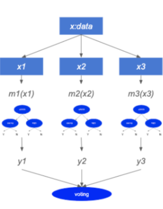
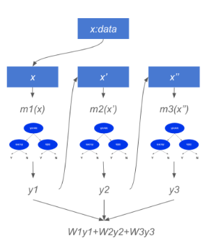

# XGBoost
2020-01-15

[참고]  <br>
https://bcho.tistory.com/1354 <br>
https://apple-rbox.tistory.com/6 <br>
https://3months.tistory.com/368 <br>
[slide share] <br>
https://www.slideshare.net/freepsw/boosting-bagging-vs-boosting

#### XGBoost란 무엇인가
XGBoost는 여러개의 Decision Tree를 조합해서 사용하는 Ensemble 알고리즘이다.  <br>
=> Ensemble은 방식에 따라서 Bagging과 Boosting으로 분류된다.

### Ensemble : Bagging and Boosting
* Ensemble은 여러개의 모델을 조합해서 그 결과를 뽑아내는 방법. 정확도가 높은 강한 모델을 하나 사용하는 것보다, <br>
정확도가 낮은 약한 모델을 여러개 조합하는 방식이 정확도가 높다는 방법에 기반한 방법

> **Bagging** <br>
여러 모델을 사용할 때, 각 모델에서 나온 값을 계산하여 최종 결과값을 내는 방식. <br>
예를들어 모델 m1,m2,m3 모델이 있을 때 입력 데이터 X를 모델 m1,m2,m3에 넣고 그 결과값을 받아서 <br>
합산 (또는 평균 등) 해서, 최종결과를 취하는 방식. <br>
모델 m1~m3 로 데이터를 넣을 때는 원본 데이터 x에서 매번 다시 샘플링해서 다른 샘플 데이터를 각각 모델에 넣는 방식. 

 <br>

> **Boosting** <br>
m1,m2,m3 모델이 있을 때, m1에는 x에서 샘플링된 데이터를 넣는다. <br>
그리고 나온 결과중에서 예측이 잘못된 x값들에 가중치를 반영해서 다음 모델인 m2에 넣는다. <br>
마찬가지로 y2결과에서 예측이 잘못된 x'값들에 가중치를 반영해서 m3에 넣는다. <br>
그리고 각 모델의 성능이 다르기 때문에 각 모델에 가중치 W를 반영한다.

 <br>


**CART (Classification And Regression Trees)** <br>
> CART의 원리 : Additive learning 으로, '의사결정 나무 모델을 여러 개 학습시켜서 예측값을 더한 것으로 결정하겠다' 
* 이렇게 더해진 예측 점수들을 이용해 결론을 내림으로서 과적합이나 기존 모델이 잘 설명하지 못하는 취약 부분에 대한 보완을 할 수 있는 힘을 만든다.
<br>

**하이퍼 파라미터와 XGBoost** <br>
regularizationn term(모델 복잡도), learning rate등을 사용자가 설정해 줘야 함. <br>
learning rate가 높을 수록 빠르게 모델의 bias를 줄여나가지만, learning rate가 적으면 디테일한 부분을 놓칠 수 있다. 

> * eta : learning rate, default = 0.3 [0,1]
    * eta는 'Step size shrinkage'로 학습 단계별로 가중치를 얼마나 적용할 지 결정하는 숫자. 
    낮을수록 보수적인 모델이 된다. (다음 단계의 결과물을 적게 반영하기 때문)
> * gamma : min split loss, default = 0, [0,무한대]
    * Gamma를 이해하기 위해서는 먼저 information gain이라는 것을 이해해야 한다. 
        * information gain은 의사결정나무가 가지를 칠 때, 즉 새로운 변수를 기준으로 데이터를 분류할 때 타겟 변수에 대해 얼마나 설명할 수 있는지를 측정하는 기준.
    * Gamma는 계산한 information gain에 패널티를 부여하는 숫자. <br>
    즉, 이값이 커질수록 의사결정나무들은 가지를 잘 만들려 하지 않게 되며, 이에 따라 보수적인 모델이 된다.
> * max_depth : default = 6
    * 의사결정나무의 깊이의 한도. 커질수록 더 복잡한 모델이 생성되며, 이는 overfitting의 문제를 일으킬 수 있다. 
> * subsample : default=1
    * training데이터셋에서 subset을 만들지, 전부를 사용할지 정하는 파라미터.<br>
    매번 나무를 만들 때 적용하며 overfitting문제를 방지하려고 사용.
> * colsample_bytree : default=1
    * 나무를 만들 때 칼럼, 즉 변수를 샘플링해서 쓸지에 대한 파라미터. <br>
    나무를 만들기 전 한 번 샘플링을 하게 됨.
> * scale_pos_weight : default=1
    * 분류 모델에서 사용하는 가중치 파라미터로, 극단적으로 적은 타겟값이 존재하는 문제에서 유용.


```python

```
