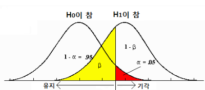

# 표본수 산출 
* GPower : 통계적 검정력을 계산하는 데 사용되는 무료 소프트웨어 <br>
이 프로그램은 t- 검정, F- 검정 및 카이-제곱 검정을 포함한 다양한 통계 검정에 대한 검정력을 계산하는 기능을 제공합니다.
http://www.gpower.hhu.de/ <br>

=> 표본수를 산출하기 위해 GPower에 입력해야 하는 값으로 효과크기(effect-size)가 있어서 이에 대해 알아보고자 함. <br>


## 효과크기 (Effect size)
https://synapse.koreamed.org/Synapse/Data/PDFData/0130HMR/hmr-35-40.pdf <br>

> 효과크기란 무엇인가
* 비교하려는 집단들 사이의 차이 혹은 관계를 나타내는 '표준화 된 지표'를 의미. <br>
    효과크기가 0이라는 것은 비교 집단들 사이의 차이가 없다는 것을 의미하여 귀무가설하에서 "효과크기=0" 이 된다.  <br>
    평균치 비교의 경우 비교하려는 집단 사이에 평균 차이가 클수록 효과크기는 커지게 된다. 
    
> 효과크기 인덱스(표준화 된 효과크기)
* 효과크기란 비교하려는 집단 사이의 실제 차이를 나타내는데, 개별 측정 단위에 따라 해석이 어려워질 수 있다.
    * 따라서 개별 측정 단위에 영향을 받지 않도록 효과크기를 그 산포정도 (표준편차 등)로 나누어 단위에 상관없이 사용할 수 있도록 한 index가 사용된다.

 <br>


#### 효과크기 사용의 장점

> 1. 기존에 사용되던 P값은 "유의한 차이가 잇다/없다" 로 해석할 수 밖에 없었으나, <br>
효과크기를 사용하면 "얼마만큼의 차이(혹은 연관성)가 있는가"를 구체적인 수치로 보여줄 수 있다. 

> 2. 효과크기는 P값과는 달리 표본 수에 의한 영향을 받지 않는다. 
    * p값은 표본수가 적은 경우에는 검정력이 떨어져 유의하지 않은 결과가 얻어질 수 있다.<br>
    반대로, 표본수가 매우 큰 경우에는 큰 의미가 없는 결과도 "통계적으로 유의"하게 얻어지는 단점이 있다.

> 3. 효과크기는 다양한 형태의 결과들을 비교 가능한 공통의 단위로 변화 시켜줌으로써 <br>
각기 다른 통계적 방법에 의해 시행된 연구 결과들을 수량적으로 통합하는 메타 분석을 시행할 때 하나의 공통 척도로 이용될 수 있다.

#### 효과크기의 이용
> 표본 수 계산 
* 표본 수 계산 과정에서 필요한 것:  <br>
단측/양측 검정여부, alpha error, beta error, 비교하려는 집단 사이의 예상 평균 차이, 예상 표준 편차.
* 효과크기 : 예상 평균 차이를 예상 표준편차로 나누어준 값 <br>
        
> 표본 수 계산을 위해 효과크기를 추정하는 방법
* 기존의 비슷한 연구 결과로부터 추정
* 비슷한 연구가 없는 경우 pilot study를 실시하여 추정
* 이 모든 방법이 어려운 경우 단지 효과크기가 클것인지(large) / 중간정도일지 (medium) / 작을지(small)만을 예상하여 적용
----------------

### 검정력 (power) = 1-beta
* 귀무가설이 거짓일 때, 귀무가설을 기각시키는 확률 
    * 또는 대립가설이 사실일 때, 대립가설을 채택할 확률.
        * (검정력이 90%라고 하면, 대립가설이 사실임에도 불구하고 귀무가설을 채택할 확률이 10%이다.)

-----------------

### 유의 수준(alpha)
1종오류를 범할 확률.

* 두 개 집단의 모평균은 실제 같은데도 잘못해서 귀무가설을 기각하게 될 확률 (모평균이 같지 않은 것으로 판단할 확률)
    * 5%의 유의성이란, 테스트 결과가 '사실이 아닐 확률'이 5%라는 뜻 (또는 사실일 확률이 95%)
    
 <br>

 <br>

 <br>

* 1종오류 : alpha
* 2종오류 : beta
* 검정력 : 1-beta


```python

```


```python

```


```python

```
