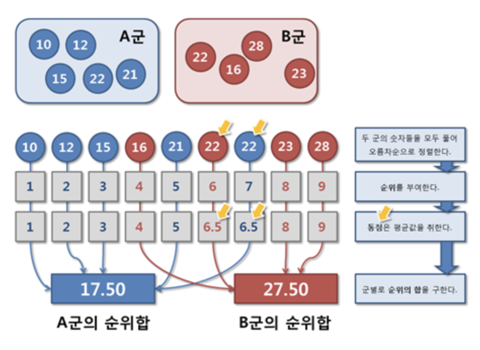
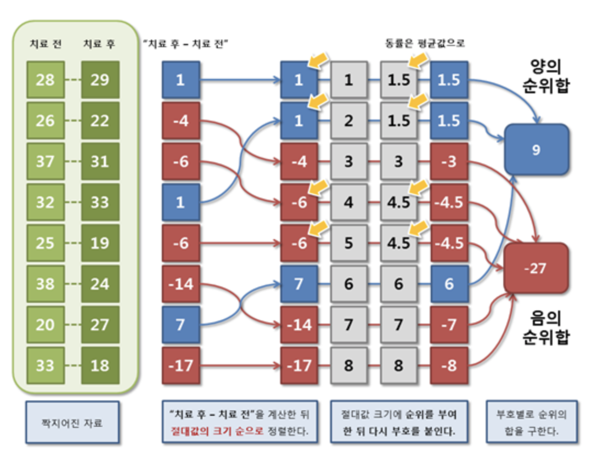
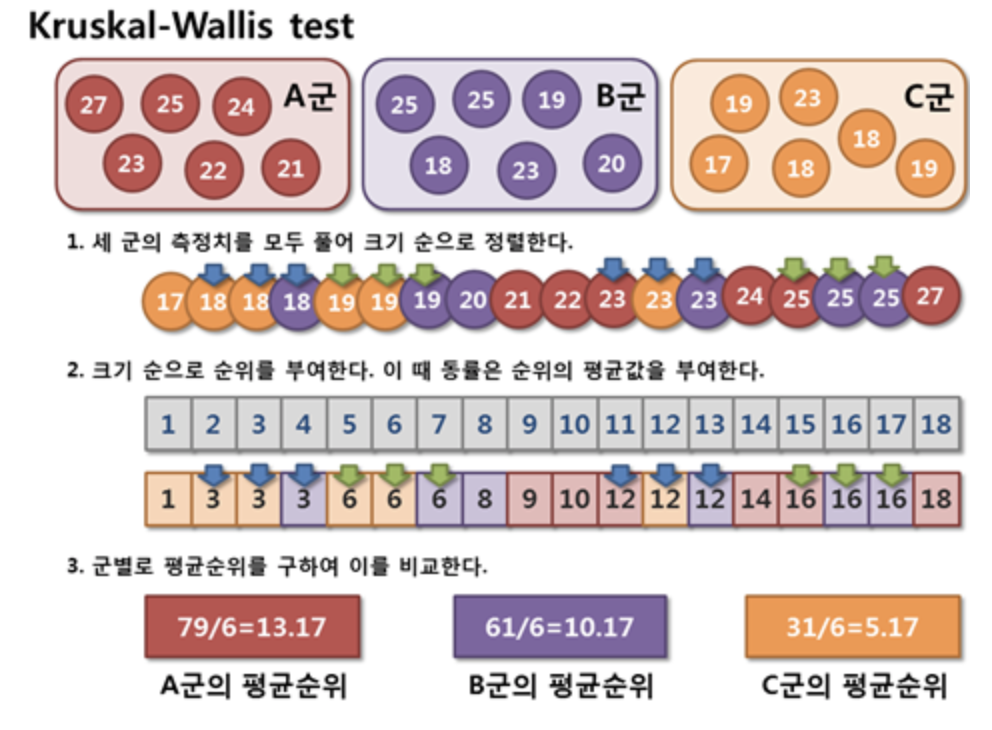

# 비모수검정법 정리 (non-parametric test)

## Mann-Whitney test

정규분포를 따른다고 가정할 수 없는 두 군은 평균을 통해 크기의 차이를 비교할 수 없다. <br>
이런 경우에는 모수의 특성을 따지지 않는 비모수적인 방법이 사용되는데, <br>
독립된 두 군의 크기를 비교하는 비모수적인 방법으로 Mann-Whitney test와 Wilcoxon rank sum test등이 있다.  <br>

이 두가지 방법은 모두 순위의 합을 기본으로 하는 검정법으로 검정통계량은 조금 다르지만 동일한 결과를 보여준다. <br>
 <br>

> 순위합 검정이란 두 군의 자료를 혼합하여 크기 순으로 정렬하여 순위를 부여한 뒤, 그 순위의 합을 군 별로 구하여 두 군의 순위합의 크기가 통계적으로 차이가 있는지 검정하는 방법이다. 
 <br>
 
 > 귀무가설 : 두 군의 순위합은 같다.  <br>
 대립가설 : 두 군의 순위합은 같지 않다  <br>

 <br>

순위합 검정은 일반적으로 독립표본 T검정에 비해 검정력이 낮으며, <br>
순위만 비교한 것이기 때문에 두 군의 크기의 차이(평균의 차이)를 언급할 수 없는 단점이 있지만<br>
정규분포에 대한 가정을 하지 않기 때문에 크기 순서가 있는 경우에는 어떤 상황에서도 적용이 가능한 장점이 있다.

## Wilcoxon signed rank test

자료의 숫자가 적거나 "치료 후 - 치료 전" 자료가 정규분포를 따른다고 할 수 없는 경우에는 모집단의 특성을 따지지 않는 비모수적인 방법을 사용해야 한다. <br>
짝지어진 자료의 크기를 비교하는 비모수적 방법은 순위합을 이용하는 Wilcoxon signed rank test이있다.

> "치료 후 - 치료 전" 을 통해 새로운 한개의 자료를 만들어서 순위합 검정을 실시한다. <br>
"치료 후 - 치료전" 자료를 절대값 순으로 나열하여 순위를 부여하는데, 이 때 동률은 평균값을 취한다.<br>
이렇게 부여된 순위를 양의 순위합과 음의 순위합으로 부호 별로 합하여 그 크기가 통계적으로 차이가 있다고 말할 수 있는지 통계검정을 실시한다. 

> 귀무가설 : 치료 전과 후의 크기가 같다.<br>
대립가설 : 치료 전과 후의 크기가 같지 않다.

 <br>

## Kruskal-Wallis test

독립된 세 군 이상의 크기를 비교하는 비모수적 방법이 Kruskal-Wallis test이다.<br>

> Kruskal-Wallis도 일종의 순위합 검정법이다. 모든 자료들을 한데 모아 크기 순으로 정렬한 다음, 가장 작은값부터 순위를 매겨 군 별로 순위합을 구한다. <br>
크기의 차이가 없는 집단들이라면 순위합도 비슷할 것이고 집단간 차이가 많이 난다면 순위합도 차이가 날것이다. <br>

순위 척도도 연속형 자료는 아니지만 순위 정보가 있으므로 순위합 검정으로 크기를 비교하는 것이 가능하다. <br>

한편, 분산분석의 기본 가정이 잘 만족될 때, Kruskal-Wallis test는 일원배치 분산분석에 비해 검정력이 다소 떨어지는 단점이 있다. 

 <br>


```python

```
